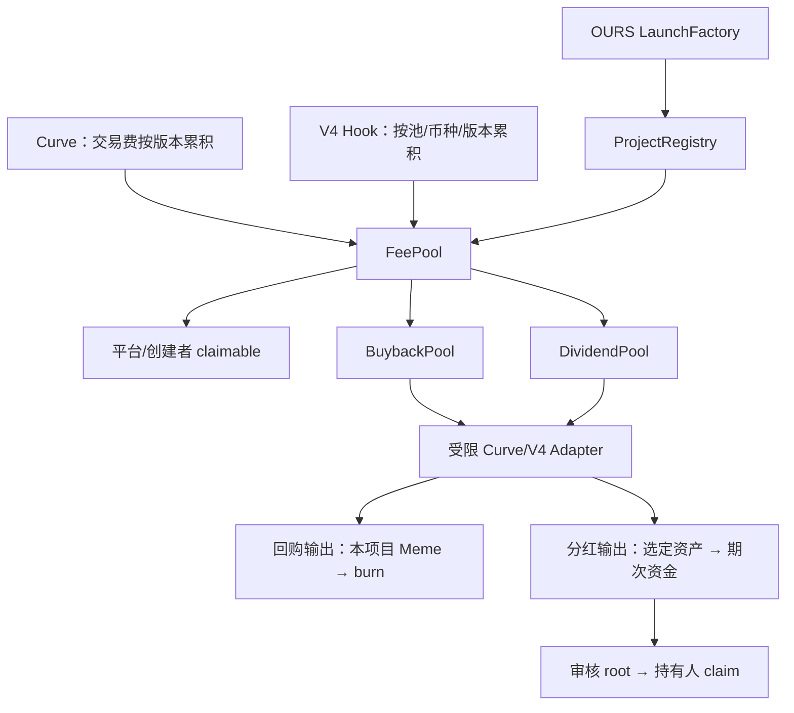

# OURS Revenue V1 合约设计

日期：2026-09-17。设计现已对应到 src 中的收益模块实现、适配器与本地测试；部署及安全审计尚未完成。Factory/Curve/Hook 生产改造仍按 PONS_INTEGRATION.md 接入，不能将协议替身测试视为真实链验证。

## 1. 确定的产品规则

- 关闭自定义收益：本策略交易费 100% 平台。
- 开启：30% 平台、70% 项目；项目部分由创建者设置回购、分红、直收比例，合计 10000 bps。
- 平台操作员与项目 controller 均可触发费用分配、回购、分红资产购买；所有兑换受独立的执行计划验证约束。
- 创建者直收可占项目部分的 100%；同时作为合格持有人按同一规则领取分红。
- 分红支持最低持仓数量，门槛由创建者选择；没有合格用户时留存资金。
- 谁发起链上交易谁付 Gas；不内置调用奖励、Gas 报销或用户资金代付。
- 每个项目、资产、策略版本资金隔离，改配置不改变历史预算权益。

### 首版建议与尚未确认项

为使接口清晰，本草案作以下显式选择，均可在实现前调整：

1. **回购后真实 burn**，不引入锁仓释放规则。`executeBuyback` 完成后调用已注册 Meme 的 burn，记录供应减少；如果选择锁定，则新增独立 locker 及释放条款，不能把死地址转账当作 totalSupply 减少。
2. **额外 creatorTax 为零**。基础 Curve/Hook 费进入本策略，发行费、Gas、DEX LP 费另算。如将 creatorTax 纳入本策略，需同时改 Curve/Hook 的计费口径和事件。
3. **每项目每版本一种分红 ERC-20**；报价资产可为原生币或白名单 ERC-20。不支持转账扣税、rebase 或无法提供精确到账的资产。股票资产的转账资格须实际验证。
4. **周期快照、门槛过滤、按余额分配**，不实现最低持有时长；最低持仓为 token 原始单位，UI 按 decimals 转换。不把单次快照包装成连续持仓。
5. 分红周期、审核延时、策略公告延时、批次限额等由部署参数明确设置，不在草案中捏造上线数值。
6. 采用多签审核分红 root，有明确中心化信任；完全链上持仓分红是替代方案，不混入本版。
7. 非升级合约，地址一次性绑定；管理员可管理白名单和暂停兑换，但不可直接提走已记账用户资产。协议升级通过新部署及新发行版本，不任意迁移既有资金。

## 2. 合约关系

同链内 projectId = 注册的 Meme 地址。跨链由 chainId 区分；EIP-712 和分红 leaf 都包含链域，不靠 symbol。三池各一份共享实例，避免每个项目重复部署。Registry 是独立策略模块，收益池不持有平台 owner 私钥。

## 3. ProjectRegistry：身份、版本与控制权

### 数据

- Project：token、curve、factory、quoteAsset、controller、pendingController、canonical V4 poolId/hook。
- PolicyVersion：enabled、buybackBps、dividendBps、creatorBps、creatorRecipient、dividendAsset、minHolding、effectiveAt、platformRecipient。
- 注册表另记录 adapter 白名单、operator 身份；高权限管理由多签控制，不和日常 operator 合并。

### 规则

- 仅受信任工厂注册，并验证 token/curve 对应关系；Curve 和 Hook 只允许为已认证项目入账。
- `buybackBps + dividendBps + creatorBps == 10000`。关闭时忽略项目比例但保留配置，不分配项目预算。
- `schedulePolicy` 仅 controller，延时生效。生效点使用预先确定的分红周期边界，不能任意挑一个区块作为快照。
- 版本创建后不可修改。当前版本通过 effectiveAt 确定，不要求某个人及时调用 activate 才能切换；实现采用 current + 单个 pending，交易入口可 O(1) 推进。
- 未生效版本可取消，生效后不可取消；历史版本仍可查询和结算，不迭代所有版本。
- controller 与 creatorRecipient 分离：前者操作与配置，后者收款。控制权采用 propose/accept 两步变更。
- 控制权变更允许新 controller 操作旧预算，但不能修改旧预算的去向与原有收款人。
- 平台收款地址也写入版本，后续更新不能把已有 claimable 改给新地址。

ABI 对应 `IOursProjectRegistry`。

## 4. FeePool：入账与确定性分账

### 资产边界

原生币统一以 address(0) 表示。ERC-20 入账必须由池 pull 并测量余额差；首版要求实际增量等于请求金额。原生币要求 msg.value == amount。捐赠和强制转入不自动归任何项目。

核心账本：
- pending[project][asset][version]：已接收、未转换/分配的费用。
- income[recipient][asset]：平台/创建者可领取。
- totalLiability[asset]：所有已记账资产义务。
- processedGross、累计各份额与 roundingReserve：防止拆单重复舍入套利；舍入余量仍属该项目版本。

只有项目已认证 Curve/Hook 能调用 creditFees。version 必须是登记过的历史版本；实际产生时所属版本由修改后的可信 source 保证，池不能单凭今天的版本推断昨日费用。Hook 入账以验证过的 poolId → token 映射为准。

### 产生时间与结算时间

每笔 swap 时读取当时的 version，按 `(project, asset, version)` 在 Curve/Hook 累积；sweep 携带该原始版本。不得所有费用先堆一个桶，再在 sweep 时套最新 policy。

费用隔离不能阻塞毕业：Curve 交易储备迁移与历史 fee bucket 独立，历史费用保留在 source 并继续允许 sweep，不因 graduated 直接禁止领取。毕业只搬走可交易本金；对未结算费用保留足额资产和版本记录。不要在毕业里循环清空所有历史版本。

### Hook 非报价币费用

Hook 可能收 Meme；FeePool 先记其真实币种。normalizeFees 使用受限兑换，把该版本 Meme 费用转换成项目报价资产，输出继续留在同版本，之后再 distribute。关闭模式也可能需要转换；归属 100% 平台不等于已经换成报价币。

转化费用不产生第二次平台分成：只有实际分配报价资产时按策略分一次。归集与币种转换不是收入增加。

### 分配公式

以每个 project/version 的累计已处理报价币 G 计算应分配总额：

- 关闭：platformTotal = G，其余 0。
- 开启：platformTotal = floor(G * 3000 / 10000)，projectTotal = G - platformTotal。
- buybackTotal = floor(projectTotal * buybackBps / 10000)。
- dividendTotal = floor(projectTotal * dividendBps / 10000)。
- creatorTotal = floor(projectTotal * creatorBps / 10000)。
- roundingReserve = projectTotal - buybackTotal - dividendTotal - creatorTotal，保留在本版本，随下一批累积分配。

每批分配“新的累计应分额 − 已分额”，使用 mulDiv 防溢出。各份额累计值单调不减，零比例不会获得尾差。新一批实际划出的项目款可能超过本批新增项目份额，这部分只能来自此前保留的 roundingReserve。用本批资金加旧余量共同结算，新余量继续保留。余量至多 2 个资产最小单位（3 个用途），不能被记为已领取或给管理员扫走。这样分批粒度不改变累计分配结果，也避免“把尾差给创建者”导致累计创建者份额下降的下溢。

`distribute` 不执行 AMM 兑换。执行 CEI + 重入保护后，通过可信 fund 接口给两池入账；若任一调用失败，整笔分配回滚，不出现一边扣款一边没到账。普通钱包领取用 pull 模式，拒收不能阻塞他人。

`claimIncome(asset)` 只支付 msg.sender 的可领取余额，不接受随意 recipient。

## 5. BuybackPool：独立回购

预算按 project/quoteAsset/version 隔离；只从 immutable FeePool 收款并原子记账。

`executeBuyback(plan, route, signature)`：
1. 校验 caller 是平台 operator 或对应 controller。
2. 验证执行计划域、purpose=Buyback、签名/nonce/deadline/signerEpoch。
3. 验证 assetIn 是项目报价资产，assetOut 是本项目 Meme，adapter/routeHash 被允许。
4. 读取项目最新 phase。Curve ready 或 Swept 时拒绝执行；不能继续沿用缓存的内盘路由。
5. 预留预算、消耗 nonce，再调用受限 adapter；失败整体回滚。
6. 测量本次输入净减少、输出净增加，验证 maxAmountIn/minAmountOut；未花出的预算保留。
7. burn 本次实际收到 Meme，记录实际 spent/burned；不得 burn 其他项目库存或捐赠余额。

回购可能部分成交：使用实际 spent；minOut 是这次计划的绝对最低到账，部分成交不足时允许回滚重新报价。不得默默缩小用户的执行保护。

内部兑换是否豁免费用必须在 Curve/Hook 明确。建议认证池/adapter 发起的内部归集与回购不重复产生可再回购收入；限制 executor、recipient、方法，不能变成普通用户免税入口。

## 6. DividendPool：资产购买、期次和领取

预算与已买入资产分离：quoteBudget、rewardInventory、epochReserve、claimed；相同资产既是预算又是奖励时也要分科目，不能重复计数。

- `acquireReward` 校验 purpose=AcquireDividend 和版本配置 rewardAsset；输出固定回 DividendPool。
- 输入等于输出资产时直接从预算移入 rewardInventory，无需签名兑换计划或路由。
- `fundEpoch` 只使用该 project/version/period 的 rewardByPeriod 余额。新期次资金单独保存，持续到账不会阻塞旧期。每个 project/version/period 只能创建一次期次。
- snapshotBlock 来自预公布周期与已确认区块。链上 timestamp 周期无法自行推出任意历史块号，分红审核多签通过 recordSnapshot 提供可核验周期映射；合约限制单调、不在未来、每个周期只写一次、不可由执行者替换。该映射本身依赖审核者的最终性判断，链上不能凭一个任意旧 blockHash 自动证明最终性。源区块哈希、清单、周期写入事件。
- 若用跨链/rollup finality，审核服务按该链最终性确定，而不是一律等待相同区块数。

### 分红资格与计算

快照余额 >= minHolding；排除该项目 Curve、canonical pool 托管/持仓合约、locker、回购池、分红池、销毁等明确系统地址。Uniswap V4 PoolManager 可能共享托管余额，不能把其地址余额按普通持有人计算。

创建者按同一条件参与。权重 = 合格快照余额；每个用户 amount=floor(fundedAmount * weight / sumWeights)。尾差留在 epoch，不承诺未分配尾差自动归创建者。没有合格用户则不发布分配 root，inventory 保留滚入后期；已 fund 的空期经审核多签确认后用 rollEmptyEpoch 回该项目/同版本/同资产未分配库存，不转任意地址；仅 Funded 且未有任何有效分配时允许，记录公开资格清单哈希并终结本期，下一期仍需重新统计资格。这依赖审核者对“无人合格”的判断。

### 状态与 root

状态：Funded → Proposed → Active。Proposed 可取消回 Funded（修正错误）后重提并重新等待完整审核期；Active 永久不可换 root。接口保留 Cancelled 枚举仅用于未激活期被整体撤销的扩展，不作为取消 proposal 的默认状态。

root 发布者是独立分红审核多签，非普通 operator、非创建者。约束 totalEntitlement <= fundedAmount，记录 manifestHash/快照/配置版本。**Merkle proof 只证明属于已发布分配，不证明持仓计算正确，也不证明所有叶子金额之和正确**；这些由公开可重算清单与多签审核保证。链上总领取上限防止超支，但恶意 root 仍可能不公平，必须明确此信任模型。

leaf 使用标准双哈希编码，绑定 chainId、DividendPool 地址、epochId、account、entitlement；不能用存在歧义的动态 abi.encodePacked。每 account 每 epoch 仅一项。

claim：校验 msg.sender 对应证明 → 已领取记录更新 → 期次 claimed <= totalEntitlement/funded → 支付 msg.sender。Active root 不变，使用 claimedAmount 实现重复领取保护；余额为零拒绝。已归属未领取本金不允许管理员重新分配，首版不设没收期限。

非合格用户不能通过切换钱包领取其他人权益，资格在快照时确定；后买入不会得到旧期分红。

## 7. 兑换计划与受限 adapter

EIP-712 ExecutionPlan 包括 project、policyVersion、purpose、adapter、routeHash、assetIn/out、maxAmountIn、minAmountOut、deadline、nonce、signerEpoch；domain 绑定 chainId 和实际执行 Pool。

- 计划签名者与提交执行者分离。创建者可以拿有效计划执行，不能自签任意价格。
- 签名者也不能突破链上目的币种、额度、接收者和路由白名单。
- 执行计划签名有效也不证明价格公平，签名服务是受信任的报价角色；需采用独立价格约束、模拟、单次/日额度。没有可靠参考价格时暂停操作，不采用可被瞬时操纵的余额比例作为唯一依据。
- signerEpoch 轮换可废止旧计划；nonce 按项目或全局唯一方案记录，计划仅成功一次；revert 不消耗预算和 nonce。
- 路由只允许受审 adapter，禁 delegatecall、任意 call、调用者任意设置 spender/recipient。
- 原生资产与 WETH 的包装位置必须在 adapter 固定；不使用自身总余额作为本次退款。代币 approve 按批次准确额度并清零。
- 限制 pool→adapter→DEX 的调用链；默认接收者始终是调用 pool，无外部任意 recipient。
- Adapter 返回值只供说明，资金核算以 pool 的实际余额变化为准。

NormalizeFees、Buyback、AcquireDividend 三种目的分域检查，签给回购池的计划不能用于分红池。

## 8. 权限与暂停

| 角色 | 权限 | 明确无权 |
|---|---|---|
| Factory | 注册项目、绑定毕业池 | 提走收益池余额 |
| Controller | 本项目配置延时变更、分配、有效计划执行 | 变更旧期分配 root、提走他人分红 |
| Platform operator | 分配、有效计划执行、毕业任务 | 更改任意项目历史资金用途 |
| Quote signer | 签受约束兑换计划 | 直接领取池资金 |
| Distribution reviewer 多签 | 审核与发布分红 root | 更换已激活 root、领取他人权益 |
| Governance 多签 | 白名单、operator/signer 管理、暂停兑换 | 任意外部调用或扫走已记账本金 |
| 收益受益人 | claim 自己余额 | 修改项目或其他人的收益 |

暂停优先按执行功能/项目隔离，暂停兑换不关闭正常 claim。资产自身冻结等故障可能阻止领取，应显示真实失败原因，不给出任意救援到管理员的默认通道。捐赠 surplus 若未来允许回收，必须先证明实际余额减去全部 liabilities，仅可回收无主余额；首版省略该入口。

## 9. PONS 具体改造位置

| 源模块 | 改造 |
|---|---|
| LaunchFactory / LaunchDeployer | 注册 controller、初始 Policy；保持 token/curve/quote 绑定；不从昵称获取身份 |
| Curve._accrueFees | 费用按当时版本累计；取消原协议/创建者五年回购 earmark |
| Curve.sweepFees | 转到 FeePool 并携带原版本；无内部回购时允许平台/creator；毕业后历史桶仍可结算 |
| Curve.graduate | 分离迁移本金与未付费用；历史费用不可进入 LP；不得无限遍历版本 |
| Hook._afterSwap | 按 canonical pool/project + 原始币种 + version 记账；不在 swap 中进行股票购买 |
| Hook.sweepPoolFees | 转出版本化库存到 FeePool；原 Meme→quote 兑换移交受限 normalizeFees 或保持等价保护，不能重复兑换 |
| FeePolicy | 删除与新策略冲突的全球 buyback 比例逻辑；每项目读取版本 |
| 原 FeeEscrow/BuybackVault | 不与新分配重复支付；新项目统一采用新池，历史项目不做未经设计的自动迁移 |

源码参考：PONS 官方 `162310fbd1217717e2f5e4cde794d6a11322b469`。当前 Factory 与 Deployer/Curve 有接口不一致，先解决版本完整性再开发接入；不能直接称为 fork 后可部署。

## 10. 资金不变量与验证矩阵

对每 asset：pool 实际余额 >= 该池所有项目/版本待处理预算 + 舍入保留余额 + 已归属未支付收入 + 期次保留本金；三池内部转移同时减少来源责任、增加目标责任，不增加总收益。

| 测试组 | 必须证明 |
|---|---|
| 关闭/开启与比例边界 | 关闭 100% 平台；开启 30/70；项目比例 0/10000 合法组合；错误总和拒绝 |
| 分批舍入 | 同样累计金额按任意批次划分，最终累计分配相同；整数边界无 underflow |
| 历史策略 | 变更前后费用不串；controller 转移不夺旧收款人权益 |
| 项目/链/资产隔离 | A 项目不能花 B 预算；计划不能跨 pool/chain/version/purpose 重放 |
| 执行保护 | 过期/伪造/撤销签名、任意路由、minOut 不足全部拒绝 |
| 真实到账 | 原生退款、部分成交、捐赠、恶意 adapter、转账扣税资产不会多记资产 |
| 毕业 | ready 窗口拒交易；迁移失败重试；历史费余额不进入 LP 也不被毕业锁死 |
| 分红 | 低于/等于/高于门槛；系统地址排除；无合格地址；舍入；创建者同规则 |
| Merkle | 错地址/错期/错链/错合约证明拒绝；重复领取拒绝；审核前不可领 |
| 恶意接收者 | 重入、拒收、黑名单资产不突破预算；单批失败不影响后续用户 swap |
| 运维 | operator Gas 不足、RPC 重组、nonce 替换、重复任务保持幂等 |

需要单元、模糊/不变量、真实 DEX fork、端到端和外部安全审阅。ABI 编译检查只是开发接口的起点。

## 11. 部署与后台对接

先部署三池（构造设置最终治理者/依赖或一遍受控绑定），再 Registry/Factory 与 adapters；若循环地址依赖，使用 CREATE2 预计算或只能一次的 initialize，由部署脚本在同一受控流程完成。对外启用前完成所有绑定与权限交接，不能留下可被第三方抢初始化的地址。

建议实施时将 Registry/池互相依赖收敛为 Registry 存储固定池地址，池构造时固定 Registry；完成一次性绑定后 permanently freeze 接收池地址，不能管理员换个池截走后续已承诺预算。

后台索引事件；原始事件键含 chainId、blockHash、txHash、logIndex，确认并处理 reorg；源状态以合约为准。所有金额字符串/bigint，任务按目的和计划 nonce 幂等。创建者与平台都调用同一公开 ABI，Gas 由调用钱包承担。

实施分期：Registry + FeePool → 修改 Curve/Hook → BuybackPool + adapters → DividendPool + 审核/领取 → 真实链联调。文档与接口尚不是实现承诺，经济参数和分红审核机制需在编码前定版。
